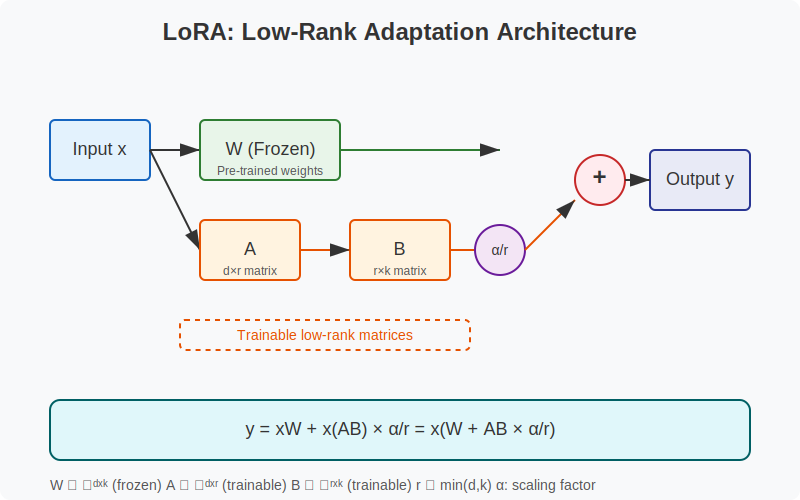

# LoRA and QLoRA: Memory-Efficient Fine-Tuning for Large Language Models

<div align="center">


</div>

This repository provides pure PyTorch implementations of [LoRA (Low-Rank Adaptation)](https://arxiv.org/abs/2106.09685) and [QLoRA (Quantized Low-Rank Adaptation)](https://arxiv.org/abs/2305.14314) for memory-efficient fine-tuning of large pre-trained models.

## Table of Contents
- [Overview](#overview)
- [Architecture](#architecture)
  - [LoRA Architecture](#lora-architecture)
  - [QLoRA Architecture](#qlora-architecture)
- [Installation](#installation)
- [Usage](#usage)
  - [LoRA Usage](#lora-usage)
  - [QLoRA Usage](#qlora-usage)
- [Training Examples](#training-examples)
  - [Image Classification with LoRA](#image-classification-with-lora)
  - [Text Classification with QLoRA](#text-classification-with-qlora)
- [Performance and Memory Efficiency](#performance-and-memory-efficiency)
- [Implementation Details](#implementation-details)
  - [LoRA Implementation](#lora-implementation)
  - [QLoRA Implementation](#qlora-implementation)
- [References](#references)
- [Contributing](#contributing)
- [License](#license)

## Overview

Fine-tuning Large Language Models (LLMs) requires enormous computational resources, making it impractical for many researchers and practitioners. LoRA and QLoRA address this challenge by dramatically reducing memory requirements while maintaining performance comparable to full fine-tuning.

### Key Advantages

- **Parameter Efficiency**: Train only a small fraction of parameters (typically <1%)
- **Memory Efficiency**: Reduce memory requirements by up to 65% (LoRA) to 85% (QLoRA)
- **Performance Preservation**: Achieve results comparable to full fine-tuning
- **Adaptability**: Compatible with various model architectures (transformers, CNNs, etc.)
- **Model Composition**: Easily switch or combine task-specific adaptations without full model copies

## Architecture

### LoRA Architecture

LoRA works by injecting trainable rank decomposition matrices into each layer of the network. The original pre-trained weights remain frozen, and only the low-rank matrices are updated during training.

<div align="center">
  
</div>

In the LoRA approach:
- The original computation: y = xW
- Is modified to: y = xW + x(AB) = x(W + AB)

Where:
- W ∈ ℝᵈˣᵏ: Pre-trained weight matrix (frozen)
- A ∈ ℝᵈˣʳ: Low-rank adaptation matrix (trainable)
- B ∈ ℝʳˣᵏ: Low-rank adaptation matrix (trainable)
- r ≪ min(d,k): Rank of the update (typically 8, 16, 32, etc.)

The scaling factor α is used to control the magnitude of the update:
- Standard LoRA: W' = W + α·AB/r
- Rank-Stabilized LoRA: W' = W + α·AB/√r

### QLoRA Architecture

QLoRA extends LoRA by applying 4-bit quantization to the frozen weights, further reducing memory usage. This enables fine-tuning of much larger models like LLaMA-70B on consumer GPUs.

<div align="center">
  
</div>

Key innovations in QLoRA:
1. **4-bit NF4 Quantization**: A data type optimized for the normal distribution observed in LLM weights
2. **Double Quantization**: Quantize the quantization constants themselves to save additional memory
3. **Paged Optimizers**: Offload optimizer states to CPU to reduce GPU memory usage
4. **BF16 LoRA Training**: Keep LoRA adapters in BF16 precision for numerical stability

## Installation

### Prerequisites
- Python 3.8+
- CUDA-compatible GPU (recommended)

### Setup

```bash
# Clone the repository
git clone https://github.com/HarshTomar1234/PyTorch-LoRA-QLoRA.git
cd PyTorch-LoRA-QLoRA

# Create and activate a virtual environment
python -m venv venv
source venv/bin/activate  # On Windows: venv\Scripts\activate

# Install dependencies
pip install -r requirements.txt
```

For detailed installation instructions, especially regarding bitsandbytes for QLoRA, see [INSTALL.md](INSTALL.md).

## Usage

### LoRA Usage

```python
from lora import LoraConfig, LoraModel

# Configure LoRA parameters
lora_config = LoraConfig(
    rank=8,  # Rank of the update matrices
    target_modules=["query", "key", "value"],  # Which modules to apply LoRA to
    lora_alpha=8,  # Scaling factor
    lora_dropout=0.1,  # Dropout probability for regularization
    bias="none",  # Whether to train biases
    use_rslora=True  # Whether to use rank-stabilized LoRA
)

# Load a pretrained model
model = AutoModelForSequenceClassification.from_pretrained("bert-base-uncased")

# Apply LoRA to the model
model = LoraModel(model, lora_config)

# Now only the LoRA parameters will be trained
# The base model parameters remain frozen
```

### QLoRA Usage

```python
from qlora import QLoRAConfig, QLoRAModel, QuantizationType, get_paged_optimizer

# Configure QLoRA parameters
qlora_config = QLoRAConfig(
    # LoRA parameters
    rank=8,
    target_modules=["query", "key", "value"],
    lora_alpha=16,
    lora_dropout=0.1,
    bias="none",
    use_rslora=True,
    
    # QLoRA parameters
    quantization=QuantizationType.NF4,  # 4-bit Normal Float quantization
    double_quant=True,  # Enable double quantization
    
    # Memory optimization
    gradient_checkpointing=True,
    paged_adamw=True  # Use paged optimizer for memory efficiency
)

# Load a pretrained model
model = AutoModelForSequenceClassification.from_pretrained("bert-base-uncased")

# Apply QLoRA to the model
model = QLoRAModel(model, qlora_config)

# Use paged optimizer to save GPU memory
optimizer = get_paged_optimizer(model, lr=2e-5, weight_decay=0.01)
```

## Training Examples

The repository includes complete examples for both LoRA and QLoRA:

### Image Classification with LoRA

```bash
python train_vit_image_classifier.py
```

This script fine-tunes a Vision Transformer (ViT) on the Food101 dataset using LoRA, targeting the attention mechanisms.

Key parameters:
- Model: google/vit-base-patch16-224
- Dataset: food101
- Rank: 8
- Target modules: query, key, value, dense
- Training time: ~1.5 hours on a single GPU

### Text Classification with QLoRA

```bash
python train_qlora_text_classifier.py
```

This script fine-tunes BERT on the IMDB sentiment classification dataset using QLoRA.

Key parameters:
- Model: bert-base-uncased
- Dataset: imdb
- Rank: 8
- Quantization: NF4 (4-bit)
- Target modules: query, key, value, dense layers
- Training time: ~30 minutes on a single GPU

## Performance and Memory Efficiency

### Memory Usage Comparison

<div align="center">
  
</div>

Below is a comparison of memory requirements for different fine-tuning approaches:

| Model Size | Full Fine-tuning | LoRA (r=8) | QLoRA (4-bit, r=8) |
|------------|------------------|------------|-------------------|
| BERT (110M) | 3.7 GB | 1.2 GB | 0.7 GB |
| RoBERTa (355M) | 10 GB | 3.7 GB | 1.1 GB |
| LLaMA (7B) | 28 GB | 14 GB | 5 GB |
| LLaMA (13B) | 52 GB | 24 GB | 8 GB |
| LLaMA (33B) | 120 GB | 60 GB | 20 GB |
| LLaMA (65B) | 240 GB | 120 GB | 40 GB |

### Trainable Parameters

| Approach | BERT Base | LLaMA (7B) | LLaMA (65B) |
|----------|-----------|------------|-------------|
| Full Fine-tuning | 110M (100%) | 7B (100%) | 65B (100%) |
| LoRA (r=8) | 0.3M (0.3%) | 4.7M (0.07%) | 9.4M (0.01%) |
| LoRA (r=16) | 0.6M (0.6%) | 9.4M (0.13%) | 18.8M (0.03%) |

### Performance Comparison

Performance of different adaptation methods on the GLUE benchmark (average score):

| Method | BERT Base | RoBERTa Large |
|--------|-----------|---------------|
| Full Fine-tuning | 84.2 | 88.3 |
| LoRA (r=8) | 83.8 | 87.9 |
| LoRA (r=16) | 84.0 | 88.1 |
| QLoRA (r=16) | 83.7 | 87.8 |

## Implementation Details

### LoRA Implementation

Our LoRA implementation includes:

1. **LoRABaseLayer**: Base class that handles common functionality
2. **LoRALinear**: Adaptation for linear (fully connected) layers
3. **LoRAEmbedding**: Adaptation for embedding layers
4. **LoRAConv2d**: Adaptation for convolutional layers
5. **LoRAModel**: A wrapper that applies LoRA to specific modules in a model

Key features:
- Support for different layer types (Linear, Embedding, Conv2d)
- Rank-stabilized LoRA option (scales by √r instead of r)
- Selective application to specific modules
- Efficient parameter updates
- Ability to merge weights for inference

### QLoRA Implementation

Our QLoRA implementation extends LoRA with:

1. **4-bit Quantization**: Using NF4 (Normal Float 4-bit) data type
2. **Double Quantization**: Further compressing quantization constants
3. **QLoRALinear**: Quantized linear layers with LoRA adaptation
4. **QLoRAEmbedding**: Embedding layers with LoRA adaptation
5. **Paged Optimizers**: Memory-efficient optimizer implementation

Key features:
- Integration with bitsandbytes for 4-bit and 8-bit quantization
- CPU offloading for optimizer states
- Gradient checkpointing support
- Fallback to standard precision when quantization is unavailable

## References

- [LoRA: Low-Rank Adaptation of Large Language Models](https://arxiv.org/abs/2106.09685) (Hu et al., 2021)
- [QLoRA: Efficient Finetuning of Quantized LLMs](https://arxiv.org/abs/2305.14314) (Dettmers et al., 2023)
- [Microsoft LoRA Repository](https://github.com/microsoft/LoRA)
- [QLoRA Repository](https://github.com/artidoro/qlora)
- [Hugging Face PEFT Library](https://github.com/huggingface/peft)
- [bitsandbytes Library](https://github.com/TimDettmers/bitsandbytes)

## Contributing

Contributions are welcome! Please feel free to submit a Pull Request.

1. Fork the repository
2. Create your feature branch (`git checkout -b feature/amazing-feature`)
3. Commit your changes (`git commit -m 'Add some amazing feature'`)
4. Push to the branch (`git push origin feature/amazing-feature`)
5. Open a Pull Request

## License

This project is licensed under the MIT License - see the [LICENSE](LICENSE) file for details. 